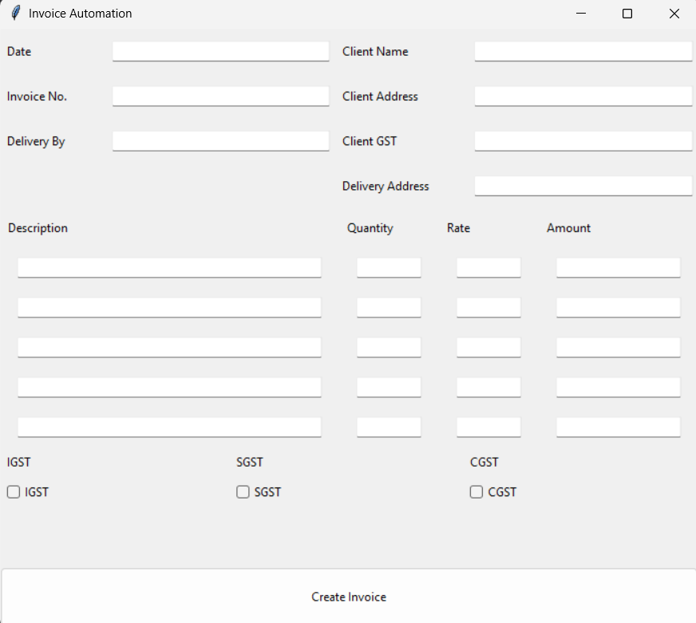

# Invoice Generator

A simple Python desktop application for generating invoices using a pre-designed Word template (`template.docx`).  
The app allows you to input client and order details, automatically calculates totals (including IGST, CGST, and SGST), and exports the invoice as a PDF.

## Notes
- Ensure LibreOffice is installed and its executable path is correctly set in the script (`soffice.exe`).

- The placeholder tags (like `[Date]`, `[Invoice]`, `[clientName]`) in `template.docx` must match the ones used in the code.

- This project is not for local use every template can have its own structure, you can fork this project only if you find some kind of error in it and want to fix or want to take idea to build you own project

## Features
- User-friendly Tkinter GUI
- Fill in client details, item descriptions, quantities, and rates
- Automatic subtotal, GST, and total calculation
- Convert a pre-filled Word invoice template into PDF (via LibreOffice)
- Supports amount in words

## Requirements
- Python 3.x
- LibreOffice (for DOCX → PDF conversion)
- Python libraries:
  ```bash
  pip install python-docx num2words
- `template.docx` invoice template in the project folder

## Usage
1. Clone this repository:
    ```bash
    git clone https://github.com/Thunderer9506/Invoice-Generator.git
    cd Invoice-Generator
2. Make sure template.docx is present in the project directory.
3. Install dependencies:
    ```bash
    pip install python-docx num2words
4. Run the app:
    ```bash
    python main.py
5. Fill in the form fields and click Create Invoice.
6. Save the generated invoice as a PDF.

## Screenshots

